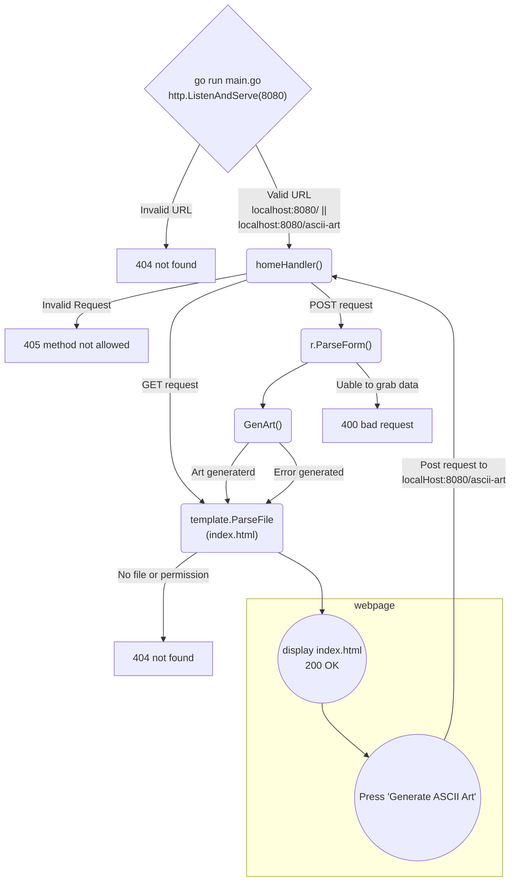

```
                      _   _                           _                                _      
                     (_) (_)                         | |                              | |     
  __ _   ___    ___   _   _   ______    __ _   _ __  | |_   ______  __      __   ___  | |__   
 / _` | / __|  / __| | | | | |______|  / _` | | '__| | __| |______| \ \ /\ / /  / _ \ | '_ \  
| (_| | \__ \ | (__  | | | |          | (_| | | |    \ |_            \ V  V /  |  __/ | |_) | 
 \__,_| |___/  \___| |_| |_|           \__,_| |_|     \__|            \_/\_/    \___| |_.__/  
                                                                                              
                                                                                              
```

# ascii-art-web
A web version of the ascii-artwith GUI for easier usability.
The website is host on the local machine on port 8080.
Only `localhost:8080/` and `localhost:8080/ascii-art`are valid URL.
When the user keys in the valid URL, a GET request is sent to the server.
And a webpage with text field with selection buttons for the user to define the parameters will be display.
When the user clicks on the `Generate ASCII Art` button, a POST request is sent to the server.
The user defined parameters will be grab and passed to the GenArt() function to generate ASCII art.


## Requirement
- start and run a server
- web GUI for ascii-art
- Must allow the use of the 3 banners
- Implement HTTP endpoints:
    - GET "/": go templates
    - POST "/ascii-art": use form to make post request
- Display result of POST in home page.
- main page must have:
    - text input
    - radio buttons
    - button
- HTTP status code
    - 200 OK
    - 404 Not found
    - 405 Bad request
    - 500 Inernal Server Error
- Include in README.md
    - descriptons
    - Authors
    - usage
    - implementation details

## Tasks
- Refactor homeHandler()?
- Implement more ASCII art functionality?
    - ANSI color won't work
- Design index.html and css
    - css not working

- Learn HTTP protocol, handlers and pattern
    - focsu on HTTP status code 
- Learn server and client

## Optionals
- export output
- stylize with css
- dockerize