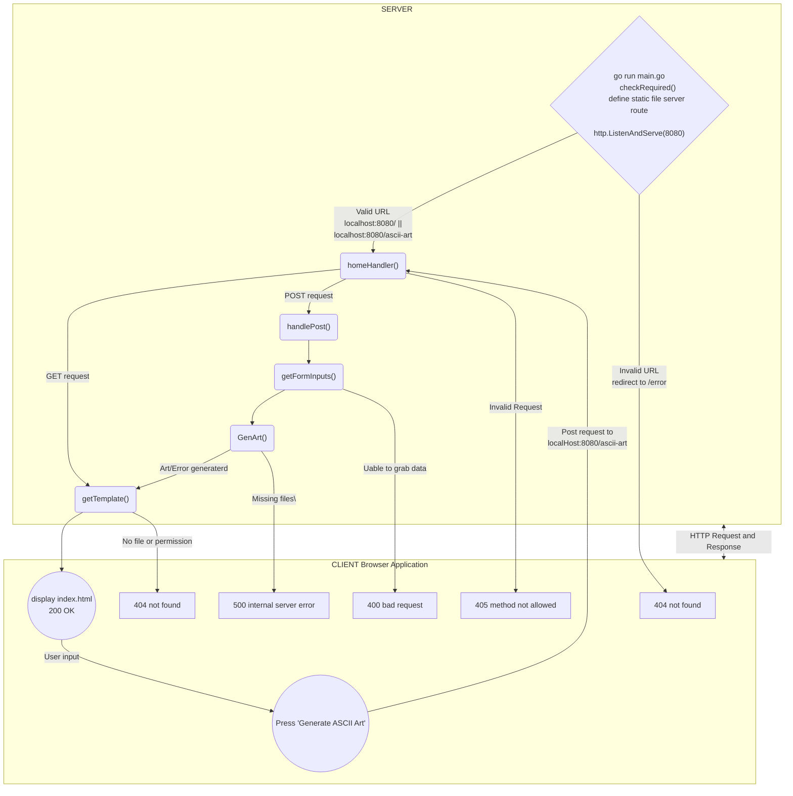

```
                      _   _                           _                                _      
                     (_) (_)                         | |                              | |     
  __ _   ___    ___   _   _   ______    __ _   _ __  | |_   ______  __      __   ___  | |__   
 / _` | / __|  / __| | | | | |______|  / _` | | '__| | __| |______| \ \ /\ / /  / _ \ | '_ \  
| (_| | \__ \ | (__  | | | |          | (_| | | |    \ |_            \ V  V /  |  __/ | |_) | 
 \__,_| |___/  \___| |_| |_|           \__,_| |_|     \__|            \_/\_/    \___| |_.__/  
                                                                                              
                                                                                              
By Allen Lee (ylee) & Othemane Afiali (oafiali)
```

# ascii-art-web
A web version of the ascii-art with GUI for easier usability.
The website is hosted on the local machine using port 8080.
Only `localhost:8080/` and `localhost:8080/ascii-art`are valid URL.

## Usage
Download the project using `git clone https://01.gritlab.ax/git/ylee/ascii-art-web.git`. Navigate to the project folder in the terminal and start the server by entering `go run main.go`. Make sure golang is installed on the machine.
Key in a valid URL, `localhost:8080/` or `localhost:8080/ascii-art`. And you will see the home page (refer to image below). You will see:
- a top bar with a link to the homepage
- an ascii art banner
- a short description on how to use the site
- a text field for user to input text
- radio buttons to select banner style
- a button to generate the ascii art. 
- result output


## Implementation
Below is a flowchart that maps out how the program works.



1. In main, checkRequired() checks if all required files are in the project folder. 
2. A static server route is define to server static files effectively to clients.
3. http.ListenAndServe(":8080", nil) starts listening on local port 8080 and use the [DefaultServeMux] to handle requests.
4. The client (browser application) can send HTTP requests to the server. The homeHandler() function is registered to the pattern `\\`, effectively handling all incoming request. If it is valid, the server will reply with a HTTP response and the 200 status code. Else, an error page with 404 status code.
5. If it is a `GET` request, getTemplate() is called. getTemplate() uses the html.Template.ParseFiles() and Execute() to generate the response file (a html in this case).
6. The response (home page) is display by the client and the user can input the desired parameters and hit the `Generate ASCII Art` button. A POST request is sent to the server when the button is clicked.
7. If it is a `POST` request, handlePost() is called. In handlePost(),
    - we grab the user inputs using getFormInputs() (http.Request.ParseForm())
    - we generate the output with GenArt()
    - and getTemplate() to generate the response with the output

Note: html.Template help us to generate the desired html response page without spending too much time on the html files. We have to include some of html.Template snytax in the html files and parse it to generate the desired result.

## Requirement
- start and run a server (DONE)
- web GUI for ascii-art (DONE)
- Must allow the use of the 3 banners (DONE)
- Implement HTTP endpoints: (DONE)
    - GET "/": go templates
    - POST "/ascii-art": use form to make post request
- Display result of POST in home page. (DONE)
- main page must have: (DONE)
    - text input
    - radio buttons
    - button
- HTTP status code - use inspector in browser to check
    - 200 OK
    - 404 Not found
    - 405 Bad request
    - 500 Inernal Server Error
- Include in README.md
    - descriptons
    - Authors
    - usage
    - implementation details

## Tasks
- main.go
    - redirecting not working. give up on redirect.
    - sanitize input. clear input of \r and leading\trailing \n in handlePost
    - input usage explaination in homepage
    - P3 - reorganize code for imrpove readability
- P4 - Improve README.md
    - descriptons
    - Authors 
    - usage
    - implementation details
- Design index.html and css
    - more functionality?
    - added icon

- Learn HTTP protocol, handlers and pattern
    - focus on HTTP status code 
- Learn server and client
- Implement more ASCII art functionality?
    - ANSI color won't work

## Optionals
- export output
- stylize with css
- dockerize