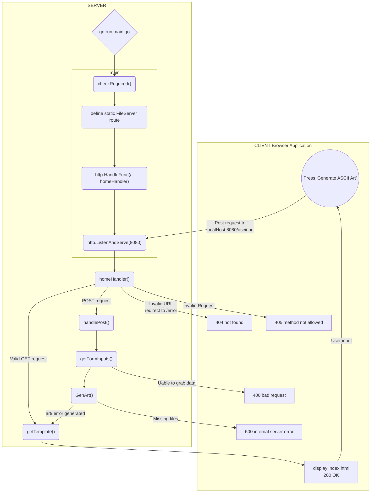

```
                      _   _                           _                                _      
                     (_) (_)                         | |                              | |     
  __ _   ___    ___   _   _   ______    __ _   _ __  | |_   ______  __      __   ___  | |__   
 / _` | / __|  / __| | | | | |______|  / _` | | '__| | __| |______| \ \ /\ / /  / _ \ | '_ \  
| (_| | \__ \ | (__  | | | |          | (_| | | |    \ |_            \ V  V /  |  __/ | |_) | 
 \__,_| |___/  \___| |_| |_|           \__,_| |_|     \__|            \_/\_/    \___| |_.__/  
                                                                                              
                                                                                              
By Allen Lee (ylee) & Othemane Afiali (oafiali)
```

# ascii-art-web
A web version of the ascii-art with GUI for easier usability.
The website is hosted on the local machine using port 8080.
Only `localhost:8080/` and `localhost:8080/ascii-art`are valid URL.

## Usage
Download the project using `git clone https://01.gritlab.ax/git/ylee/ascii-art-web.git`. Navigate to the project folder in the terminal and start the server by entering `go run main.go`. Make sure golang is installed on the machine.
Key in a valid URL, `localhost:8080/` or `localhost:8080/ascii-art`. And you will see the home page (refer to image below). You will see:
- a top bar with a link to the `homepage` and `about`
- an ascii art banner
- a short description on how to use the site
- a text field for user to input text
- radio buttons to select banner style
- a button to generate the ascii art. 
- result output


Simply enter the your text, select the banner style and click the button to generate the ASCII art banner.
Leading and trailing newlines will be remove (user can enter the newlines themselves).
Only ASCII character 32 to 127 and newline is considered acceptable input.

If non-printable ASCII characters are given, an error message will be given.


## Implementation
Below is a flowchart that maps out how the program works.



1. In main, checkRequired() checks if all required files are in the project folder. 
2. A static server route is define to server static files effectively to clients.
3. The homeHandler() function is registered to the pattern `\`, handling incoming requests to the root (in this situation, it is effectively handling all incoming requests).
4. http.ListenAndServe(":8080", nil) starts listening on local port 8080 and use the [DefaultServeMux] to handle requests.
5. The client (browser application) can send HTTP requests to the server.  If it is valid, the server will reply with a HTTP response and the 200 status code. Else, an error page with 404 status code.
5. If it is a valid `GET` request, getTemplate() is called. getTemplate() uses the html.Template.ParseFiles() and Execute() to generate the response file (a html).
6. The response (home page) is display by the client and the user can input the desired parameters and hit the `Generate ASCII Art` button. A POST request is sent to the server when the button is clicked.
7. If it is a `POST` request, handlePost() is called. In handlePost(),
    - we grab the user inputs using getFormInputs() (http.Request.ParseForm())
    - we generate the output with GenArt()
    - and getTemplate() to generate the response with the output

Note:
- html.Template help us to generate the desired html response page without spending too much time on the html files. We have to include some of html.Template snytax in the html files and parse it to generate the desired result.
- When encountering an error with a HTTP request or response, errorHandler() is used to generate a custom error page. If the `error.html` is not found, a simple error message is display instead.

## Tasks
- main.go
    - reorganize code for imrpove readability (Ozzy)
- Improve README.md (Allen)
    - descriptons
    - Authors 
    - usage
    - implementation details
- Design index.html and css
    - more functionality?
    - added icon

- Learn HTTP protocol, handlers and pattern
    - focus on HTTP status code 
- Learn server and client
- Implement more ASCII art functionality?
    - ANSI color won't work

## Optionals
- export output
- stylize with css (Basically done)
- dockerize